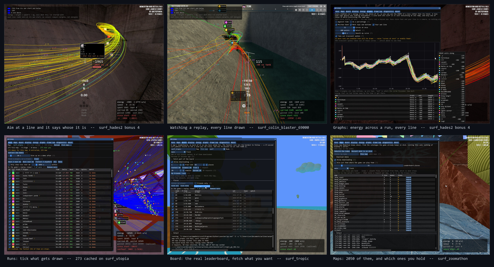
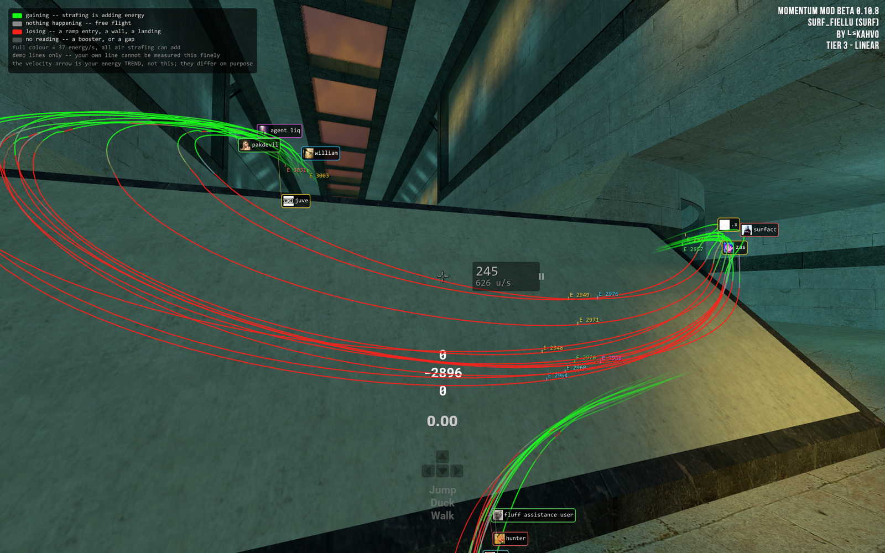

# Demo Line Practice Tool

Draws other players' runs as **lines in the world**, in the Momentum Mod map you are playing.
See the route, see where they carried speed and where you don't.





---

## Get it running

1. **[Download the latest release](https://github.com/ProtoAus/demo-line-practice-tool/releases/latest)** — the `.zip`.
2. **Extract it** anywhere you like.
3. **Start Momentum Mod and load into a map.**
4. **Double-click `wrinject.exe`.**
5. **Press `INSERT`** in game.

Then: **Runs** tab → **Extract new demos**. Wait for it. The lines appear when it finishes.

That reads the demos the game has already downloaded. For runs it hasn't, the **Board** tab lists
the map's real leaderboard and you tick what you want and fetch it.

> Extraction needs **Python** (`py.exe` or `python.exe` on PATH). The panel tells you which one it
> found. Nothing else needs it.

---

## Keys

| key | |
| --- | --- |
| `INSERT` | show / hide the panel |
| `ESC` | close it |
| `Page Down` / `Page Up` | the box at your crosshair — next / previous mode |
| `Home` | *whose line am I looking at* — off by default |
| `End` | the corner block — off by default |

All but `INSERT` are rebindable, and the **About** tab lists them as they are currently bound.
They are **read, not swallowed**, so if one collides with something you have bound, the game still
acts on it too.

---

## What you get

**Colour the lines by whatever you are chasing** — strafing efficiency, raw speed, energy, or where
each run placed. Numbers at every top and bottom say what a line carried *through* a ramp and what
it bought with it. Aim at a line (`Home`) and it tells you whose it is and how you compare at that
exact point.

**Energy across a whole run, plotted.** A line that sags gently was leaking everywhere; a line with
one cliff in it lost the lot at one ramp — and only one of those is worth practising the same way.
Your own last attempt is on there too, and it survives failing, so you can look at what went wrong
*after* it went wrong.

Also worth finding:

- **Save-loc times.** The game has a `time` field for save-locs and never fills it in, so this keeps
  its own. Load a save-loc and your run clock goes back with it.
- **A live strafe gauge** — `Page Down` to it. Green to red on how close you are to the most energy
  air strafing could physically add.
- **Watch any demo you have.** Press **watch** on a run and paste the command it copies into the
  console. Don't hunt for it in the Downloaded tab; that tab is built from leaderboard rows, not
  from the folder, so a demo you dropped in only shows up if the game had already listed it.
- **Your settings stay put**, in `wrlines_data\settings.cfg`, panel position included.

---

## Fair play

This is an injected DLL. It **reads** memory rather than writing it, sets no cvars, runs no console
commands, and never touches `sv_cheats` — but injected code may still invalidate a submitted run
under Momentum's own rules. **If you care about a run counting, don't have this loaded while you set
it.**

## Your data

Nothing leaves your machine unless you press a button that says it will. No telemetry, no analytics,
no phone-home of any kind — the DLL links no HTTP client at all, and you can check that yourself:
`dumpbin /dependents wrlines.dll` lists five Windows system DLLs and nothing else. Every request to
Momentum's servers is made by `wrpath_extract.py`, which you can read.

Everything it creates lives in a `wrlines_data` folder next to the DLL. Nothing is written into your
game install unless you press **send**, **local** or **watch** on a run — those copy one demo into
Momentum's replay folder so the game can play it, and **take out** removes it again.

---

## Build it yourself

```
git clone --depth 1 --branch v1.91.9b https://github.com/ocornut/imgui imgui
git clone --depth 1 https://github.com/TsudaKageyu/MinHook minhook
build.bat
```

Needs MSVC Build Tools and the Windows SDK. Close the game first — the DLL never unloads.
`tests\build.bat` builds and runs the test harnesses.

## How it works

There is no entity access here and no game API: it finds the camera by scanning memory for the
world-to-screen matrix, reads run paths out of the game's own `.mtv` demos, and projects the lines
itself. If you want the long version — what is measured, what is approximate, and the things that
were tried and thrown away — it is all in **[docs/how-it-works.md](docs/how-it-works.md)**.

## Licence

MIT — see [LICENSE](LICENSE).

Dear ImGui is MIT (Omar Cornut and contributors). MinHook is BSD-2-Clause (Tsuda Kageyu).
Neither is redistributed here; both are cloned at build time.

Not affiliated with or endorsed by Momentum Mod or Strata Source.
